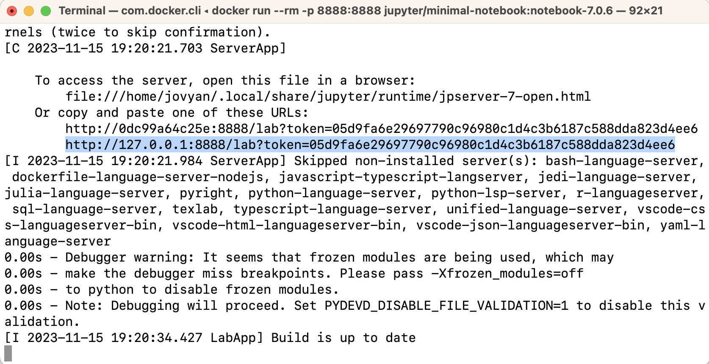

# Breast Cancer Predictor

- author: Tiffany Timbers, Melissa Lee & Joel Ostblom

Demo of a data analysis project for DSCI 522 (Data Science workflows); a
course in the Master of Data Science program at the University of
British Columbia.

## About

Here we attempt to build a classification model using the k-nearest neighbours algorithm which can use breast cancer tumour image measurements to predict whether a newly discovered breast cancer tumour is benign (i.e., is not harmful and does not require treatment) or malignant (i.e., is harmful and requires treatment intervention). Our final classifier performed fairly well on an unseen test data set, with the F2 score, where beta = 2, of 0.96 and an overall accuracy calculated to be 0.96. On the 171 test data cases, it correctly predicted 168.
However it incorrectly predicted 3 cases, and importantly these cases were false negatives; predicting that a tumour is benign when in fact it is malignant. These kind of incorrect predictions could have a severly negative impact on a patients health outcome, thus we recommend continuing study to improve this prediction model before it is put into production in the clinic.


The data set that was used in this project is of digitized breast cancer
image features created by Dr. William H. Wolberg, W. Nick Street, and
Olvi L. Mangasarian at the University of Wisconsin, Madison (Street,
Wolberg, and Mangasarian 1993). It was sourced from the UCI Machine
Learning Repository (Dua and Graff 2017) and can be found
[here](https://archive.ics.uci.edu/ml/datasets/Breast+Cancer+Wisconsin+\(Diagnostic\)),
specifically [this
file](http://mlr.cs.umass.edu/ml/machine-learning-databases/breast-cancer-wisconsin/wdbc.data).
Each row in the data set represents summary statistics from measurements
of an image of a tumour sample, including the diagnosis (benign or
malignant) and several other measurements (e.g., nucleus texture,
perimeter, area, etc.). Diagnosis for each image was conducted by
physicians.

## Report

The final report can be found
[here](https://ttimbers.github.io/breast_cancer_predictor_py/).

## Dependencies

- [Docker](https://www.docker.com/) is a container solution 
used to manage the software dependencies for this project.
The Docker image used for this project is based on the
`quay.io/jupyter/minimal-notebook:notebook-7.0.6` image.
Additional dependencies are specified int the [`Dockerfile`](Dockerfile).

## Usage

Follow the instructions below to reproduce the analysis.

#### Setup

1. [Install](https://www.docker.com/get-started/) 
and launch Docker on your computer.

2. Clone this GitHub repository.

#### Running the analysis

1. Navigate to the root of this project on your computer using the command line 
and enter the following command to reset the project to a clean state 
(i.e., remove all files generated by previous runs of the analysis):

``` 
docker-compose run --rm analysis-env make clean
```

2. To run the analysis in its entirety, 
enter the following command in the terminal in the project root:

```
docker-compose run --rm analysis-env make all
```

## Developer notes

### Working with the project in the container using Jupyter lab

1. Navigate to the root of this project on your computer using the command line and enter the following command:

```
docker compose up analysis-env
```

2. In the terminal, look for a URL that starts with
`http://127.0.0.1:8888/lab?token=` 
(for an example, see the highlighted text in the terminal below). 
Copy and paste that URL into your browser.



3. You should now see the Jupyter lab IDE in your browser, 
with all the project files visible in the file browser pane 
on the left side of the screen.

#### Clean up

1. To shut down the container and clean up the resources, 
type `Cntrl` + `C` in the terminal
where you launched the container, and then type `docker compose rm`

### Working with the project in the container using VSCode

Note if you prefer to work in VS Code, you can run the following 
from the root of the project in a terminal in VS Code 
to launch the container in the terminal there:

```
docker compose run --rm terminal bash
```

To exit the container type `exit` in the terminal.


### Adding a new dependency

1. Add the dependency to the `Dockerfile` file on a new branch.

2. Re-build the Docker image locally to ensure it builds and runs properly.

3. Push the changes to GitHub. A new Docker
   image will be built and pushed to Docker Hub automatically.
   It will be tagged with the SHA for the commit that changed the file.

4. Update the `docker-compose.yml` file on your branch to use the new
   container image (make sure to update the tag specifically).

5. Send a pull request to merge the changes into the `main` branch. 

### Running the tests
Tests are run using the `pytest` command in the root of the project.
To run them using the project's Docker container you can run:

```
docker-compose run --rm analysis-env pytest
```
More details about the test suite can be found in the 
[`tests`](tests) directory.

## License

The Breast Cancer Predictor report contained herein are licensed under the
[Attribution-NonCommercial-ShareAlike 4.0 International (CC BY-NC-SA 4.0) License](https://creativecommons.org/licenses/by-nc-sa/4.0/).
See [the license file](LICENSE.md) for more information. . If
re-using/re-mixing please provide attribution and link to this webpage.
The software code contained within this repository is licensed under the
MIT license. See [the license file](LICENSE.md) for more information.

## References

<div id="refs" class="references hanging-indent">

<div id="ref-Dua2019">

Dua, Dheeru, and Casey Graff. 2017. “UCI Machine Learning Repository.”
University of California, Irvine, School of Information; Computer
Sciences. <http://archive.ics.uci.edu/ml>.

</div>

<div id="ref-Streetetal">

Street, W. Nick, W. H. Wolberg, and O. L. Mangasarian. 1993. “Nuclear
feature extraction for breast tumor diagnosis.” In *Biomedical Image
Processing and Biomedical Visualization*, edited by Raj S. Acharya and
Dmitry B. Goldgof, 1905:861–70. International Society for Optics;
Photonics; SPIE. <https://doi.org/10.1117/12.148698>.

</div>

</div>
